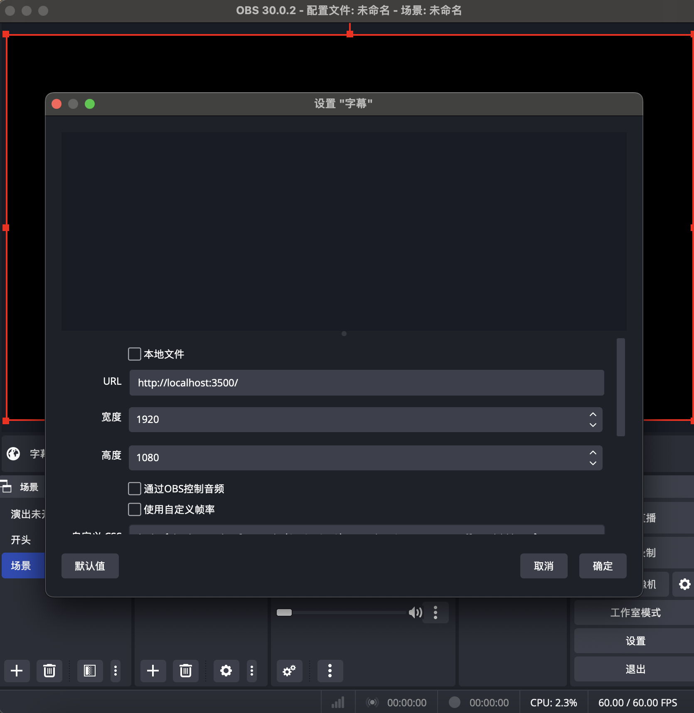
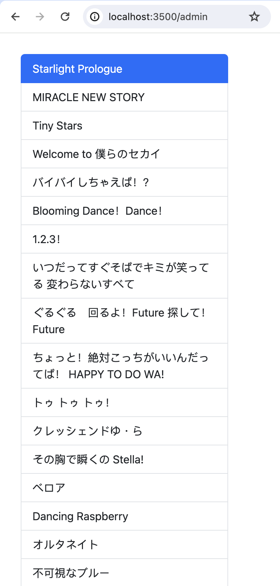

<a name="readme-top"></a>

<div align="center">
<h3 align="center">Live Subtitle</h3>
  <p align="center">
    基于 ASS 字幕的直播实时字幕工具
    <br />
    适用于固定字幕内容的直播（例如演唱会）的实时字幕
  </p>
</div>

[![Contributors][contributors-shield]][contributors-url]
[![Forks][forks-shield]][forks-url]
[![Stargazers][stars-shield]][stars-url]
[![Issues][issues-shield]][issues-url]
[![MIT License][license-shield]][license-url]

<!-- TABLE OF CONTENTS -->
<details>
  <summary>目录</summary>
  <ol>
    <li>
      <a href="#效果">效果</a>
    </li>
    <li>
        <a href="#技术栈">技术栈</a>
    </li>
    <li>
      <a href="#快速开始">快速开始</a>
      <ul>
        <li><a href="#前置条件">前置条件</a></li>
        <li>
            <a href="#安装">安装</a>
        </li>
        <li>
            <a href="#使用">使用</a>
            <ul>
              <li><a href="#渲染端">渲染端</a></li>
              <li><a href="#控制台">控制台</a></li>
              <li><a href="#上传字幕">上传字幕</a></li>
            </ul>
        </li>
      </ul>
    </li>
    <li><a href="#待解决问题">待解决问题</a></li>
    <li><a href="#贡献">贡献</a></li>
    <li><a href="#许可证">许可证</a></li>
    <li><a href="#联系">联系</a></li>
    <li><a href="#致谢">致谢</a></li>
  </ol>
</details>

<!-- 效果 -->

## 效果


> UNIVERSE!!<br>直播录像（哔哩哔哩）：[BV1mp421R7cu](https://www.bilibili.com/video/BV1mp421R7cu/)

项目基于 ASS，支持特效字幕。

支持大多数 SSA/ASS 功能（[libass](https://github.com/libass/libass) 所支持的一切功能）

<p align="right">(<a href="#readme-top">回到顶端</a>)</p>

## 技术栈

-   [Javascript Subtitles Octopus](https://github.com/libass/JavascriptSubtitlesOctopus)

-   [Socket.IO](https://socket.io/)

-   [Express](https://expressjs.com/)

<p align="right">(<a href="#readme-top">回到顶端</a>)</p>

<!-- GETTING STARTED -->

## 快速开始

### 前置条件

-   node.js
-   npm

### 安装

```sh
# 克隆仓库
git clone https://github.com/koszzz/liveSubtitle.git

# 进入仓库
cd liveSubtitle

# 安装依赖
npm install

# 运行服务器
node app.js
# Server listening at http://localhost:3500
```

### 使用

#### 渲染端

> 使用 OBS Studio 演示



1. 添加来源为 `浏览器`
2. 将 URL 设置为 `http://localhost:3500/`
3. 宽度设置为 1920，高度设置为 1080
4. 将此来源置于画面最上层，铺满画面

#### 控制台

进入 `http://localhost:3500/admin`



**字幕选择**

点选字幕列表中的项目，不会变更字幕的显示与否。

**字幕操作**

-   按下键盘**方向左键**可使字幕隐藏或显示。
-   按下键盘**方向下键**可切换到下一句，并使字幕显示。
-   按下键盘**方向上键**可切换到上一句，并使字幕显示。

#### 上传字幕

1. 将`.ass`字幕存放于 `./assets/subtitles/`
2. 配置`./assets/subtitles/config.json`

```json
{
    // 所需字体，存放于./assets/fonts
    "fonts": ["NotoSerifSC-Bold.otf", "NotoSerifJP-Bold.otf"],
    "configs": [
        {
            "name": "字幕名称",
            "file": ".ass字幕文件名称",
            // 动画时间
            "animationTime": {
                "in": 500, // 从完全消失到完全出现的时间，毫秒
                "out": 400 // 从完全出现到完全消失的时间，毫秒
            }
        }
    ]
}
```

**字幕要求**

-   每句字幕间不得有间隔
-   每句字幕的进入与退出时间需固定
-   每句字幕进入后需立马退出

示例字幕文件见 [./assets/subtitles/](https://github.com/koszzz/liveSubtitle/tree/main/assets/subtitles)

<p align="right">(<a href="#readme-top">回到顶端</a>)</p>

<!-- ROADMAP -->

## 待解决问题

-   [ ] 优化控制台 UI
-   [ ] 适配复杂特效

查看 [Open Issues](https://github.com/koszzz/liveSubtitle/issues) 获取建议和已知问题的完整列表。

<p align="right">(<a href="#readme-top">回到顶端</a>)</p>

<!-- CONTRIBUTING -->

## 贡献

贡献使开源社区成为学习、启发和创造的绝佳场所。 **非常感谢您所做的一切贡献**。

如果您有更好的建议，请 Fork 该仓库并创建 Pull Request。 您也可以使用 Tag “enhancement” 打开 Issue。

请不要忘记给此项目一个 Star！再次感谢！

1. Fork 项目
2. 创建您的功能分支 (`git checkout -b feature/AmazingFeature`)
3. 提交您的修改 (`git commit -m '加入了一些很棒的功能'`)
4. 推送到分支 (`git push origin feature/AmazingFeature`)
5. 开启一个 Pull Request

<p align="right">(<a href="#readme-top">回到顶端</a>)</p>

<!-- LICENSE -->

## 许可证

以 MIT 协议开源。查看 [`LICENSE`](LICENSE) 以获取更多信息。

<p align="right">(<a href="#readme-top">回到顶端</a>)</p>

<!-- CONTACT -->

## 联系

项目地址: [https://github.com/koszzz/liveSubtitle](https://github.com/koszzz/liveSubtitle)

在[爱发电](https://afdian.net/a/kyruui)支持我

<a href="https://afdian.net/a/kyruui"></a>

<p align="right">(<a href="#readme-top">回到顶端</a>)</p>

<!-- ACKNOWLEDGMENTS -->

## 致谢

-   [依然洳雪](https://space.bilibili.com/13184888)
-   [QQ 频道【Liella!】](https://pd.qq.com/s/7nucz4r4z)

<p align="right">(<a href="#readme-top">回到顶端</a>)</p>

<!-- MARKDOWN LINKS & IMAGES -->
<!-- https://www.markdownguide.org/basic-syntax/#reference-style-links -->

[contributors-shield]: https://img.shields.io/github/contributors/koszzz/liveSubtitle.svg?style=for-the-badge
[contributors-url]: https://github.com/koszzz/liveSubtitle/graphs/contributors
[forks-shield]: https://img.shields.io/github/forks/koszzz/liveSubtitle.svg?style=for-the-badge
[forks-url]: https://github.com/koszzz/liveSubtitle/network/members
[stars-shield]: https://img.shields.io/github/stars/koszzz/liveSubtitle.svg?style=for-the-badge
[stars-url]: https://github.com/koszzz/liveSubtitle/stargazers
[issues-shield]: https://img.shields.io/github/issues/koszzz/liveSubtitle.svg?style=for-the-badge
[issues-url]: https://github.com/koszzz/liveSubtitle/issues
[license-shield]: https://img.shields.io/github/license/koszzz/liveSubtitle.svg?style=for-the-badge
[license-url]: https://github.com/koszzz/liveSubtitle/blob/master/LICENSE
