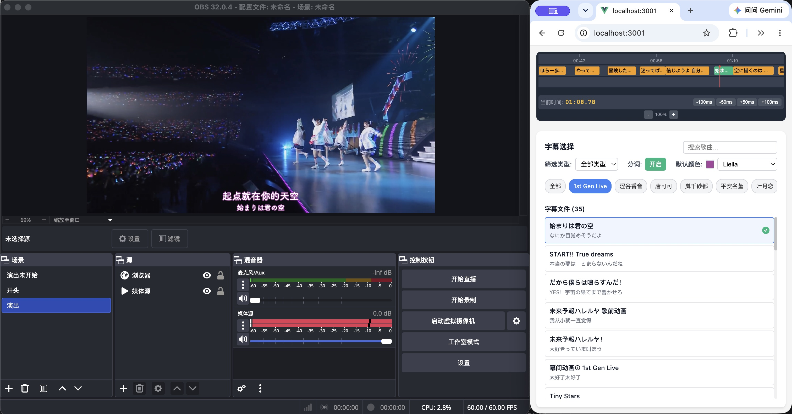

<a name="readme-top"></a>

<div align="center">
<h3 align="center">Live Subtitle</h3>
  <p align="center">
    基于 ASS 字幕的直播实时字幕工具
    <br />
    适用于固定字幕内容的直播（例如演唱会）实时字幕
    <br />
    Nuxt 4 + Nitro + Socket.io + JavascriptSubtitlesOctopus
  </p>
</div>

> 这是 2025 年夏天 [Liella! 频道](https://pd.qq.com/s/7nucz4r4z)对 [Liella! 1<sup>st</sup> Gen Live](https://zh.moegirl.org.cn/LoveLive!Superstar!!_Liella!_First_Generation_LoveLive!_~Wonderful_Starlines~) 进行转播时所用的实时字幕工具，在 2026 年 7 月借助 AI 进行重构与整理并开源。可能存在不合理之处，欢迎提交 Issue 和 Pull Request

> 我们也提供了截至当时所制作的全部字幕文件，包括字幕稿与 ASS 字幕，均经过人工校对，可在 [subtitleFiles](https://github.com/LiellaGuild/liveSubtitle/tree/main/subtitleFiles) 中查看

> 这个版本使用预制时间轴，在转播过程中有更好的效果。我们在 2024 年夏天开源过的版本，使用时需要人工打轴，请查看 [former](https://github.com/LiellaGuild/liveSubtitle/tree/former) 分支



> _始まりは君の空_

<!-- TABLE OF CONTENTS -->
<details>
  <summary>目录</summary>
  <ol>
    <li><a href="#功能特性">功能特性</a></li>
    <li><a href="#技术栈">技术栈</a></li>
    <li><a href="#项目结构">项目结构</a></li>
    <li><a href="#快速开始">快速开始</a></li>
    <li><a href="#使用">使用</a></li>
    <li><a href="#api-端点">API 端点</a></li>
    <li><a href="#socketio-事件">Socket.io 事件</a></li>
    <li><a href="#键盘控制">键盘控制</a></li>
    <li><a href="#字幕文件格式">字幕文件格式</a></li>
    <li><a href="#字幕制作工作流">字幕制作工作流</a></li>
    <li><a href="#许可证">许可证</a></li>
  </ol>
</details>

<!-- 功能特性 -->

## 功能特性

### 控制端 (`/`)

- Adobe Premiere Pro 风格的时间轴界面
- 双轨道设计（轨道 1 和轨道 2），可用于画外音、双主唱等字幕的定位
- 实时播放头显示，点击字幕块快速定位
- 自动播放功能
- 紧凑设计，适合小窗口
- 键盘控制支持
- 预设条件快速筛选字幕

### 展示端 (`/subtitle`)

- 1920×1080 全屏展示页面
- 使用 [JavascriptSubtitlesOctopus](https://github.com/libass/JavascriptSubtitlesOctopus) 渲染 ASS 字幕
- 支持大多数 SSA/ASS 功能（libass 所支持的一切）
- 动态加载字体文件（TTF / OTF / TTC / WOFF / WOFF2）
- Socket.io 事件驱动，内部计时器同步
- 透明背景，适合 OBS 叠加

### 字幕选择器

- 基于 JSON 配置的预设条件筛选
- 实时搜索过滤
- 艺人专属颜色方案
- 字幕颜色开关

<p align="right">(<a href="#readme-top">回到顶端</a>)</p>

## 技术栈

- **全栈框架**: [Nuxt 4](https://nuxt.com/)（Nitro Server Engine）
- **前端**: [Vue 3](https://vuejs.org/) + TypeScript
- **状态管理**: [Pinia](https://pinia.vuejs.org/)
- **实时通信**: [Socket.io](https://socket.io/) + [@xarenas107/nuxt-socket-io](https://nuxt.com/modules/socket-io)
- **字幕渲染**: [JavascriptSubtitlesOctopus](https://github.com/libass/JavascriptSubtitlesOctopus) (libass WASM)

<p align="right">(<a href="#readme-top">回到顶端</a>)</p>

## 项目结构

```
liveSubtitle_new/
├── pages/                   # 页面（Nuxt 文件路由）
│   ├── index.vue            # 控制端 /
│   └── subtitle.vue         # 展示端 /subtitle
├── components/              # Vue 组件
│   ├── Timeline.vue         # 时间轴组件
│   └── SubtitleSelector.vue # 字幕选择器
├── stores/                  # Pinia 状态管理
│   └── subtitle.ts          # 字幕全局状态
├── server/                  # Nitro 服务端
│   ├── api/                 # API 路由
│   │   ├── subtitles.get.ts         # GET /api/subtitles
│   │   ├── subtitle-file/[id].get.ts # GET /api/subtitle-file/:id
│   │   ├── subtitles/[id].get.ts    # GET /api/subtitles/:id
│   │   ├── filter-config.get.ts     # GET /api/filter-config
│   │   ├── fonts.get.ts             # GET /api/fonts
│   │   └── health.get.ts            # GET /api/health
│   ├── plugins/
│   │   └── socket.ts        # Socket.io 事件 relay（Nitro plugin）
│   └── utils/
│       └── subtitle.ts      # 字幕数据读取工具
├── types/                   # TypeScript 类型定义
│   └── subtitle.ts
├── utils/                   # 客户端工具
│   ├── api.ts               # API 请求函数
│   └── fontLoader.ts        # 字体动态加载
├── public/                  # 静态资源
│   ├── js/                  # JavascriptSubtitlesOctopus WASM
│   └── fonts/               # 字体文件
├── assets/
│   └── main.css             # 全局样式
├── shims/
│   └── debug.mjs            # debug 模块 ESM shim
├── test/
│   └── server/
│       └── subtitle.test.ts # 服务端单元测试
├── scripts/                 # 工具脚本
│   ├── lyrics2ass.js        # 歌词 → ASS 转换
│   ├── generateConfig.js    # 配置生成
│   └── llwiki.js            # Wiki 数据抓取
├── nuxt.config.ts           # Nuxt 配置
├── tsconfig.json            # TypeScript 配置
├── vitest.config.ts         # Vitest 配置
├── .prettierrc              # Prettier 配置
└── package.json
```

<p align="right">(<a href="#readme-top">回到顶端</a>)</p>

## 快速开始

### 前置条件

- [Node.js](https://nodejs.org/) >= 18
- [pnpm](https://pnpm.io/installation) >= 9

### 安装

```bash
# 安装依赖
pnpm install
```

### 开发

```bash
# 启动开发服务器（前后端一体化）
pnpm dev
```

开发服务器默认运行在 `http://localhost:3000`

### 生产构建

```bash
# 构建
pnpm build

# 预览构建产物
pnpm preview
```

### 测试

```bash
# 运行测试
pnpm test

# 单次运行（CI）
pnpm test:run
```

### 代码格式化

```bash
pnpm lint
```

<p align="right">(<a href="#readme-top">回到顶端</a>)</p>

## 使用

### 展示端（OBS 叠加）

1. OBS Studio → 添加来源 → **浏览器**
2. URL 设为 `http://localhost:3000/subtitle`
3. 宽度 1920，高度 1080
4. 将此来源置于画面最上层

### 控制端

浏览器打开 `http://localhost:3000/`

- 上方时间轴：查看播放进度
- 下方字幕选择器：搜索/筛选/选择字幕文件
- 选择文件后自动开始播放

<p align="right">(<a href="#readme-top">回到顶端</a>)</p>

## 键盘控制

| 按键 | 功能                                     |
| ---- | ---------------------------------------- |
| `←`  | 轨道 1：隐藏当前字幕，回到开始时间，暂停 |
| `↓`  | 轨道 1：播放下一条字幕，自动播放         |
| `↑`  | 轨道 1：播放上一条字幕，自动播放         |
| `A`  | 轨道 2：隐藏当前字幕，回到开始时间，暂停 |
| `S`  | 轨道 2：播放下一条字幕，自动播放         |
| `W`  | 轨道 2：播放上一条字幕，自动播放         |

<p align="right">(<a href="#readme-top">回到顶端</a>)</p>

## API 端点

所有端点均在 Nuxt Nitro 服务端，端口 3000。

| 端点                         | 说明                      |
| ---------------------------- | ------------------------- |
| `GET /api/subtitles`         | 获取所有字幕文件列表      |
| `GET /api/subtitles/:id`     | 获取单个字幕文件详情      |
| `GET /api/subtitle-file/:id` | 获取原始 ASS 字幕文件内容 |
| `GET /api/filter-config`     | 获取过滤器配置            |
| `GET /api/fonts`             | 获取字体文件列表          |
| `GET /api/health`            | 健康检查                  |

<p align="right">(<a href="#readme-top">回到顶端</a>)</p>

## Socket.io 事件

| 事件名               | 方向            | 说明                     |
| -------------------- | --------------- | ------------------------ |
| `play-state-change`  | 控制端 → 展示端 | 播放/暂停状态切换        |
| `time-sync`          | 控制端 → 展示端 | 时间同步（跳转、暂停）   |
| `file-selected`      | 控制端 → 展示端 | 字幕文件选择             |
| `ass-content-update` | 控制端 → 展示端 | ASS 内容更新（颜色切换） |

<p align="right">(<a href="#readme-top">回到顶端</a>)</p>

## 字幕文件格式

### 目录结构

```
subtitleFiles/
├── filter-config.json      # 过滤器配置
└── 歌曲名/                 # 每个歌曲一个文件夹
    ├── config.txt          # 字幕时间轴配置
    ├── subtitle.ass        # ASS 字幕文件
    └── lyrics.txt          # 原歌词文件
```

### lyrics.txt 格式

前四行为属性，之后为歌词正文：

```
歌曲名
译者（无译者时填词作者）
歌词来源（通常为 URL）
备注行（可留空）
中文歌词1
日文歌词1
中文歌词2
日文歌词2
```

> 可使用 `scripts/llwiki.js` 从 LLWiki 获取歌词（浏览器控制台执行）。

### subtitle.ass 格式

ASS 字幕样式命名规范：

| 样式模式 | 命名格式                   | 示例             |
| -------- | -------------------------- | ---------------- |
| 一般字幕 | `{语言}-{说话者罗马字}`    | `日文-Keke`      |
| 注音字幕 | `{语言}-f-{说话者罗马字}`  | `日文-f-Keke`    |
| 画外音   | `{语言}-外-{说话者罗马字}` | `中文-外-Liella` |

**分词**：

演出版和 CD 版存在差异的，以演出版为准。两人及以上同时演唱一部分时，使用 Liella 色，小组歌曲同样适用。

**轨道**：

- 轨道 1：主要轨道
- 轨道 2：次要轨道（通常用于画外音、第二主唱）

**歌词**：

非特殊情况以歌词本为准，包括断句。注音依照歌词本，应加于外文字幕正上方。单语字幕应调整竖直位置于双语字幕的垂直中心。

### config.txt 格式

每行用逗号分隔：

```
轨道编号,开始时间,结束时间,歌词文本
```

示例：

```
1,0:00:16.36,0:00:21.14,こんなとこじゃ終われないよ
1,0:00:21.63,0:00:26.08,一滴だけこぼす想い
```

- **轨道编号**: 1 或 2
- **时间格式**: `时:分:秒.毫秒`

> 可使用 `scripts/generateConfig.js` 从 ASS 文件的 `Dialogue:` 行自动生成 `config.txt`（浏览器控制台执行）。

### filter-config.json 格式

```json
[
    {
        "name": "始まりは君の空",
        "type": "album",
        "songs": ["始まりは君の空", "Dancing Heart La-Pa-Pa-Pa!"]
    }
]
```

- `type` 可选值：`album`（专辑/单曲）、`unit`（小组）、`live`（演出）、`solo`（独唱）

### 字体文件

字体放置在 `public/fonts/` 目录，支持：`.ttf` `.otf` `.ttc` `.woff` `.woff2`

### 颜色

- #A5469C Liella
- #FF7F27 Kanon
- #43D1D9 Keke
- #FF6E90 Chisato
- #4B9C40 Sumire
- #0000A0 Ren
- #ABA229 Kinako
- #FF3535 Mei
- #7FB0A6 Shiki
- #FF51C4 Natsumi
- #D895F0 Margarete
- #27A7AE Tomari
- #FF683D SunnyPassion
- #9A1B5A Mao
- #B4AA2B Yuna

<p align="right">(<a href="#readme-top">回到顶端</a>)</p>

## 字幕制作工作流

### 1. 准备歌词

在 `subtitleFiles` 下以歌曲名创建文件夹，新建 `lyrics.txt`。

格式参考上方 [lyrics.txt 格式](#lyricstxt-格式)。对于 LLWiki 来源，可使用 `scripts/llwiki.js` 在浏览器控制台执行来获取歌词。

### 2. 生成 ASS 初稿

将 `scripts/lyrics2ass.js` 于浏览器控制台执行，在 `const lyrics =`; `` 的反引号中粘贴 `lyrics.txt` 全文，即可获得 ASS 字幕初稿。在歌曲文件夹中创建 `subtitle.ass`，粘贴内容。

### 3. 分词

在 VS Code 中打开 `subtitle.ass`。于字幕样式的 `中文-` 或 `日文-` 后输入说话人罗马字。单句内的分词使用 `{\r}` 标签切换样式。

### 4. 打轴

用 [Aegisub](https://github.com/Aegisub/Aegisub) 打开 `subtitle.ass` 文件。导入**演出版**视频，进行打轴。

### 5. 生成配置文件

将 `scripts/generateConfig.js` 于浏览器控制台执行，在 `const ass =`.split("\n"); `` 的反引号中粘贴 `subtitle.ass` 中所有 `Dialogue:` 开头的行，生成 `config.txt` 内容。在歌曲文件夹中创建 `config.txt`，视情况调整轨道编号。

### 6. 添加筛选器

在 `subtitleFiles/filter-config.json` 中按 [filter-config.json 格式](#filter-configjson-格式) 添加条目。

### 7. 校对

- 模拟生产环境，在浏览器中检查字幕效果
- 机器校对：中日文标签、`{\r}` 格式、双轨时间一致性

<p align="right">(<a href="#readme-top">回到顶端</a>)</p>

## 许可证

以 MIT 协议开源。查看 [`LICENSE`](LICENSE) 以获取更多信息。

<p align="right">(<a href="#readme-top">回到顶端</a>)</p>
